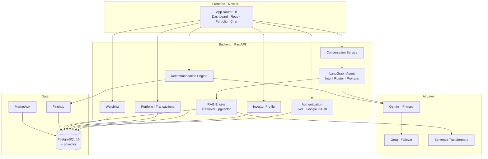
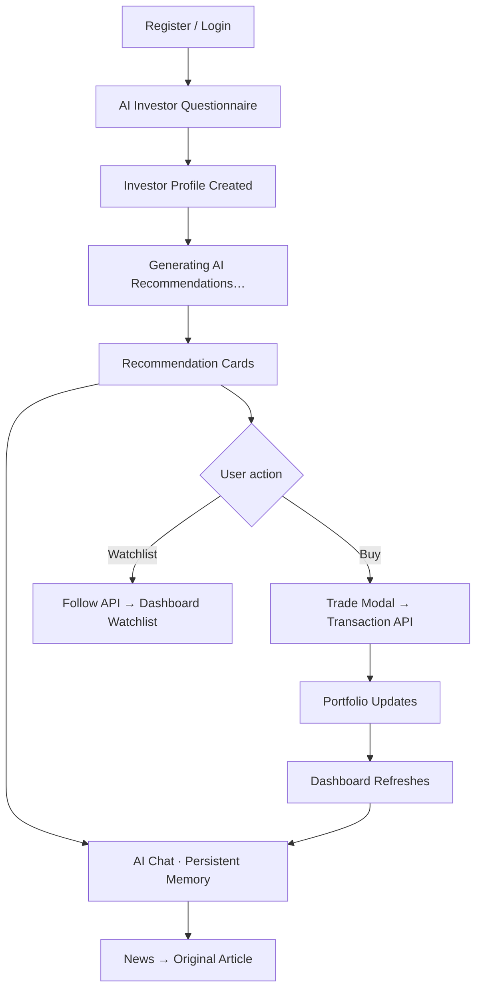
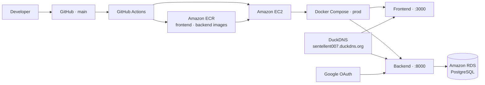
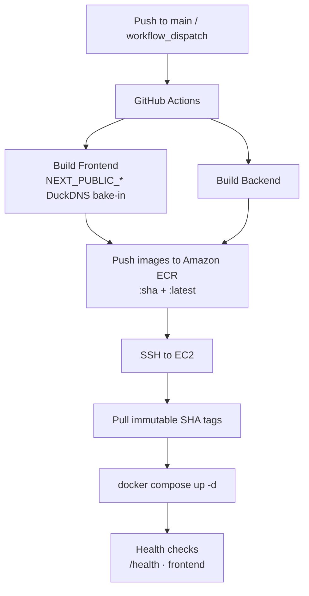

<div align="center">

# Sentellent AI

### AI-Powered Indian Stock Intelligence Platform

An intelligent investment platform that combines **Retrieval-Augmented Generation (RAG)**, AI-powered stock recommendations, portfolio analysis, market intelligence, and personalized investment guidance — built for the Indian markets (NSE / BSE).

<br />

[](https://www.python.org/)
[](https://fastapi.tiangolo.com/)
[](https://nextjs.org/)
[](https://www.typescriptlang.org/)
[](https://www.postgresql.org/)
[](https://www.docker.com/)
[](https://aws.amazon.com/)
[](https://www.terraform.io/)
[](https://github.com/features/actions)
[](https://developers.google.com/identity)
[](https://ai.google.dev/)

<br />

**Theme** · Matte black · Deep red accents · Glassmorphism · Premium AI fintech

`http://sentellent007.duckdns.org:3000`

</div>

---

## Project Overview

**Sentellent** is a full-stack AI fintech product that behaves like a personal investment assistant for Indian equities — not a disconnected set of pages.

| Capability | What it does |
|---|---|
| **AI Investor Questionnaire** | Captures risk, style, sectors, market-cap preference, horizon, budget, goals, and experience |
| **Personalized Recommendations** | Scores NSE stocks against the investor profile with confidence, risk, expected return, and AI explanations |
| **Portfolio Tracking** | Holdings, allocation view, buy/sell transactions, and automatic dashboard refresh |
| **AI Financial Assistant** | Streaming chat with conversation memory, portfolio/watchlist context, and source-backed answers |
| **Watchlist** | Single source of truth via follow/unfollow APIs, surfaced on the dashboard |
| **News Intelligence** | Market headlines that open the original publisher article in a new tab |
| **RAG Engine** | pgvector retrieval + LangGraph agent for grounded financial responses |
| **Cloud Deployment** | Docker images on Amazon ECR, EC2 runtime, Amazon RDS, Terraform + GitHub Actions |

The product journey is designed as one loop:

**Questionnaire → Recommendations → Buy / Watchlist → Portfolio → Dashboard → AI Chat that remembers you.**

---

## Architecture



<details>
<summary><strong>Chat request path (streaming)</strong></summary>

<br />

`Next.js UI → POST /chat/stream (SSE) → ConversationService → AgentGraph (intent → optional RAG → prompt) → FailoverProvider (Gemini ⇢ Groq) → token stream`

Every turn injects investor profile, portfolio holdings, watchlist, recent transactions, and conversation history so the assistant stays portfolio-aware.

</details>

---

## UI Showcase

> Visual language: matte black (`#0B0B0B`), deep red (`#D62828`), glass cards, soft shadows, and Outfit / Space Grotesk typography.

| Surface | Preview |
|---|---|
| **Dashboard** |  |
| **Recommendations** |  |
| **Portfolio** |  |
| **AI Chat** |  |
| **Investor Questionnaire** |  |
| **Watchlist** |  |
| **Authentication** |  |
| **News** |  |

> Add PNG/WebP captures under `docs/screenshots/` using the filenames above.

---

## Application Flow



After onboarding, the UI shows a staged generation experience:

**Saving Investor Profile → Generating AI Recommendations → Analyzing Current Market → Ranking Stocks → Cards**

---

## Features

### Authentication

| Feature | Status |
|---|---|
| Email / password register & login | Implemented |
| Google OAuth (Authlib + CSRF state cookie) | Implemented |
| JWT bearer sessions | Implemented |
| OAuth token handoff via URL hash | Implemented |

### Investor Intelligence

| Feature | Status |
|---|---|
| AI Investor Questionnaire | Implemented |
| Risk tolerance profiling | Implemented |
| Investment style, sectors, market cap | Implemented |
| Horizon, budget, goals, experience | Implemented |
| Profile used by recommendations + chat | Implemented |

### Recommendations

| Feature | Status |
|---|---|
| Personalized stock scoring | Implemented |
| AI confidence score | Implemented |
| Risk level & time horizon | Implemented |
| Expected return estimate | Implemented |
| AI explanation + sources | Implemented |
| Buy · View Details · Watchlist actions | Implemented |
| Post-onboarding generation UX | Implemented |

### Portfolio & Trading

| Feature | Status |
|---|---|
| Holdings & allocation chart | Implemented |
| Buy / sell via Trade Modal | Implemented |
| Transaction timeline | Implemented |
| Dashboard auto-refresh after trades | Implemented |

### AI Chat

| Feature | Status |
|---|---|
| Streaming SSE responses | Implemented |
| Persistent conversation (`GET /chat/active`) | Implemented |
| Resume latest conversation (no silent new threads) | Implemented |
| Portfolio / watchlist / trade context in prompts | Implemented |
| Markdown, sources, follow-ups, regenerate | Implemented |
| Gemini primary · Groq failover | Implemented |

### Dashboard · Watchlist · News

| Feature | Status |
|---|---|
| Portfolio summary & KPIs | Implemented |
| Watchlist widget (shared follow API) | Implemented |
| Recommendation preview | Implemented |
| Recent transactions | Implemented |
| Market news → publisher URL (`target=_blank`) | Implemented |
| Quick AI actions | Implemented |

---

## Technology Stack

| Layer | Technologies |
|---|---|
| **Frontend** | Next.js 16 · React 19 · TypeScript · Tailwind CSS 4 · Framer Motion |
| **Backend** | FastAPI · SQLAlchemy 2 · Alembic · Pydantic Settings · JWT · Google OAuth |
| **AI** | Google Gemini · Groq (failover) · LangGraph · Sentence Transformers · pgvector RAG |
| **Data** | PostgreSQL 16 · Finnhub · MarketAux |
| **Infrastructure** | Docker · Docker Compose · AWS EC2 · AWS RDS · AWS ECR · Terraform · GitHub Actions · DuckDNS |

---

## AWS Architecture



| Resource | Role |
|---|---|
| **Amazon ECR** | Stores versioned `sentellent-frontend` / `sentellent-backend` images |
| **Amazon EC2** | Runs production Compose (frontend + backend only) |
| **Amazon RDS** | Managed PostgreSQL (no Postgres container in prod) |
| **Terraform** | Networking, compute, database, security groups |
| **DuckDNS** | Public hostname for UI, API, and OAuth callback |
| **GitHub Actions** | Build → push ECR → SSH deploy → health checks |

---

## CI/CD Workflow



<details>
<summary><strong>Required GitHub secrets</strong></summary>

<br />

| Secret | Purpose |
|---|---|
| `AWS_ACCESS_KEY_ID` / `AWS_SECRET_ACCESS_KEY` | ECR push + login password for EC2 |
| `AWS_REGION` / `AWS_ACCOUNT_ID` | Registry targeting |
| `EC2_HOST` / `EC2_USERNAME` / `EC2_SSH_KEY` | Deploy over SSH |
| `NEXT_PUBLIC_API_URL` / `NEXT_PUBLIC_SITE_URL` | Optional; stale Elastic IP values are overridden to DuckDNS |

</details>

---

## Docker

### Local development (`backend/docker-compose.yml`)

| Container | Purpose |
|---|---|
| **postgres** | PostgreSQL 16 + **pgvector** (vector store for RAG) |
| **backend** | FastAPI · Alembic migrations on start |
| **frontend** | Next.js (optional Compose profile `web`) |

### Production (`backend/docker-compose.prod.yml`)

| Container | Purpose |
|---|---|
| **backend** | FastAPI image from ECR → Amazon RDS |
| **frontend** | Next.js image from ECR |
| **PostgreSQL** | **Not** containerized — Amazon RDS |

Vector search uses the **pgvector** extension inside PostgreSQL (local Compose volume / RDS), not a separate vector database product.

---

## Setup Instructions

### Prerequisites

- Python **3.13**
- Node.js **22**
- Docker Desktop (recommended)
- PostgreSQL 16 + pgvector *(if not using Compose)*

### 1. Clone

```bash
git clone https://github.com/MohammedShuraim/sentinel-ai.git
cd sentinel-ai
```

### 2. Backend (local)

```bash
cd backend
python -m venv .venv
# Windows
.venv\Scripts\activate
# macOS / Linux
# source .venv/bin/activate

pip install -r requirements.txt
copy .env.example .env          # Windows
# cp .env.example .env          # macOS / Linux
# Fill SECRET_KEY, DATABASE_URL, Google OAuth, Gemini/Groq keys
alembic upgrade head
uvicorn app.main:app --reload
```

### 3. Frontend (local)

```bash
cd frontend
npm ci
copy .env.example .env.local    # optional overrides
npm run dev                     # http://localhost:3000
```

### 4. Docker — local full stack

```bash
cd backend
copy .env.example .env          # set passwords + API keys
docker compose up --build
# with frontend:
docker compose --profile web up --build
```

| Service | URL |
|---|---|
| Frontend | http://localhost:3000 |
| Backend / Swagger | http://localhost:8000/docs |
| Postgres | Compose network only |

### 5. Database migrations

```bash
cd backend
alembic upgrade head
```

Production containers run migrations via `docker-entrypoint.sh` on start.

---

## Project Structure

```text
sentinel-ai/
├── .github/workflows/
│   └── deploy.yml                 # Build → ECR → EC2 deploy
├── frontend/
│   ├── app/
│   │   ├── (app)/                 # dashboard · stocks · portfolio · chat · recommendations
│   │   ├── (auth)/                # login · register
│   │   ├── auth/callback/         # Google OAuth handoff
│   │   └── page.tsx               # Landing
│   ├── components/
│   │   ├── ui/ · layout/ · brand/
│   │   ├── dashboard/ · stocks/ · portfolio/
│   │   ├── recommendations/ · chat/ · onboarding/
│   │   └── landing/ · providers/
│   ├── hooks/                     # useChat · usePortfolio · useRecommendations …
│   ├── lib/                       # API client · scoring · chat store · motion
│   └── Dockerfile
├── backend/
│   ├── app/
│   │   ├── api/                   # Auth · chat · stocks · portfolio · recommendations …
│   │   ├── core/                  # Settings · DI singletons
│   │   ├── graph/                 # LangGraph agent · prompts · state
│   │   ├── services/              # RAG · LLM providers · conversations · scoring
│   │   ├── models/ · schemas/ · crud/ · db/
│   │   └── main.py
│   ├── alembic/                   # Schema migrations
│   ├── data/                      # NSE seed CSV
│   ├── docker-compose.yml         # Local: postgres + backend (+ frontend)
│   ├── docker-compose.prod.yml    # EC2: backend + frontend → RDS
│   └── Dockerfile
├── terraform/                     # AWS networking · EC2 · RDS
├── scripts/deploy-ec2.sh          # Remote pull / up / health
├── docs/                          # Design docs · screenshot placeholders
└── readme.md
```

---

## Environment Variables

### Frontend (`NEXT_PUBLIC_*` — baked at build time)

| Variable | Description |
|---|---|
| `NEXT_PUBLIC_API_URL` | Backend base URL reachable from the browser |
| `NEXT_PUBLIC_SITE_URL` | Canonical site origin (metadata / sitemap) |

Templates: `frontend/.env.example`, `frontend/.env.prod.example`

### Backend

| Variable | Description |
|---|---|
| `DATABASE_URL` | PostgreSQL connection string |
| `SECRET_KEY` | JWT signing secret |
| `ALGORITHM` / `ACCESS_TOKEN_EXPIRE_MINUTES` | JWT config |
| `GOOGLE_CLIENT_ID` / `GOOGLE_CLIENT_SECRET` / `GOOGLE_REDIRECT_URI` | Google OAuth |
| `CORS_ORIGINS` / `FRONTEND_URL` | Browser origins + post-login redirect |
| `GEMINI_API_KEY` / `GROQ_API_KEY` | AI providers |
| `PRIMARY_PROVIDER` / `FALLBACK_PROVIDER` | Failover policy (`gemini` → `groq`) |
| `FINNHUB_API_KEY` / `MARKETAUX_API_KEY` | Market data (optional) |
| `ENABLE_DATA_IMPORTS` | Gate seed/import routes (`false` on public EC2) |

Templates: `backend/.env.example`, `backend/.env.prod.example`

### Production hostname

| Surface | URL |
|---|---|
| Frontend | `http://sentellent007.duckdns.org:3000` |
| API | `http://sentellent007.duckdns.org:8000` |
| OAuth callback | `http://sentellent007.duckdns.org:8000/auth/google/callback` |

> **Never commit real `.env` files.** They are gitignored.

---

## Deployment

### Production path

1. Provision AWS with **Terraform** (`terraform/` → VPC, EC2, RDS, security groups).
2. Point **DuckDNS** at the EC2 public address.
3. Place `backend/.env` on the instance (from `.env.prod.example`) with RDS URL, secrets, DuckDNS CORS / OAuth URIs, and `ENABLE_DATA_IMPORTS=false`.
4. Push to `main` → **GitHub Actions** builds images, pushes to **ECR**, SSHs to **EC2**, pulls the commit SHA tags, restarts Compose, runs health checks.

### Useful checks

```bash
docker compose -f docker-compose.prod.yml ps
curl http://127.0.0.1:8000/health
curl http://127.0.0.1:3000/
curl http://sentellent007.duckdns.org:8000/health
```

Ensure the RDS security group allows `5432` from the EC2 app security group, and EC2 allows `22` / `3000` / `8000` (and `80`/`443` if you terminate TLS later).

---

## Screenshots

Place product captures here for recruiters and reviewers:

```text
docs/screenshots/
├── dashboard.png
├── recommendations.png
├── portfolio.png
├── ai-chat.png
├── questionnaire.png
├── auth.png
├── watchlist.png
└── news.png
```

| Screen | File |
|---|---|
| Dashboard | `docs/screenshots/dashboard.png` |
| Recommendations | `docs/screenshots/recommendations.png` |
| Portfolio | `docs/screenshots/portfolio.png` |
| AI Chat | `docs/screenshots/ai-chat.png` |
| Investor Questionnaire | `docs/screenshots/questionnaire.png` |
| Google Login | `docs/screenshots/auth.png` |
| Watchlist | `docs/screenshots/watchlist.png` |

---

## API Surface

| Area | Endpoints |
|---|---|
| Auth | `POST /auth/register` · `POST /auth/login` · `GET /auth/google/login` · `GET /auth/google/callback` |
| Chat | `POST /chat/` · `POST /chat/stream` · `GET /chat/active` |
| Investor profile | `GET/PUT /investor-profile/` |
| Recommendations | `GET /recommendations/` |
| Stocks / watchlist | `GET /stocks` · follow / unfollow |
| Portfolio | holdings · summary |
| Transactions | `POST /transactions/buy` · `POST /transactions/sell` |
| Ops | `GET /health` · `GET /db-test` |

Interactive docs: `http://localhost:8000/docs`

---

## Future Enhancements

| Idea | Direction |
|---|---|
| **Portfolio analytics** | Live P/L, drawdown, and performance attribution once reliable quotes are wired end-to-end |
| **Explainable AI** | Deeper factor breakdowns behind each recommendation score |
| **Risk prediction** | Forward-looking volatility / concentration alerts |
| **Sector allocation** | Target vs actual sector mix with rebalance suggestions |
| **Real-time alerts** | Push / email for watchlist moves and news spikes |
| **Richer sentiment** | Broader multi-source sentiment overlays on the dashboard |

---

## Contributors

Sentellent is built as a production-minded AI fintech system — clean architecture, reusable services, and an opinionated product journey.

Contributions that improve reliability, UX polish, or AI grounding are welcome.

1. Fork the repository  
2. Create a feature branch (`git checkout -b feature/your-improvement`)  
3. Commit with a clear message  
4. Open a pull request describing **why** the change matters  

Please keep PRs focused. Prefer extending existing APIs and components over introducing parallel systems.

---

## License

Distributed under the **MIT License**. See [`LICENSE`](LICENSE) for details.

---

<div align="center">

**Sentellent AI** — intelligent Indian stock analysis, end to end.

Matte black · Deep red · Built to feel like one assistant, not five apps.

</div>
